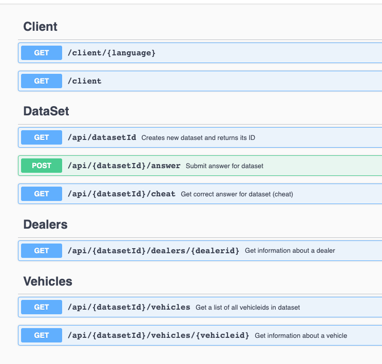

## Home Assessment


### How to test
1.  git clone in your local
2.  install virtual env
       - `python3 -m venv myvenv`
3.  install requirements package
       - `pip install -r requirements.txt`
4.  run this command
       - `python3 main.js`
5.  you will get this
    ```
    <Response [200]>
    {'success': True, 'message': 'Congratulations.', 'totalMilliseconds': 9159}
    >>> async time: 9.358373165130615
    ```


### Explanation
```
Using the provided API, create a program that retrieves a datasetID, retrieves all vehicles and dealers for that dataset, and successfully posts to the answer endpoint. Each vehicle and dealer should be requested only once. You will receive a response structure when you post to the answer endpoint that describes status and total ellapsed time; your program should output this response.

The server has a built in delay that varies between 1 and 4 seconds for each request for a vehicle or for a dealer. Focus on optimizing for low total elapsed time between retrieving the datasetid and posting the answer. A successful submission will complete in significantly less than 30 seconds.
```


### Given API endpoint

